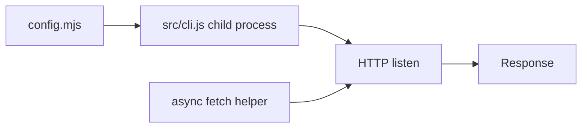

# Mock server tests

Black-box HTTP scenarios for the Nipuu mock server. These are not colocated unit tests. Unit tests stay next to the module they cover and run with `npm test`.

## Directory

| File | Role |
|---|---|
| `config.mjs` | Fixture `MODEL` + `ROUTE` loaded by the CLI |
| `client.ts` | Start/stop the CLI and `fetch` helper |
| `mockserver.test.ts` | QA journeys (happy path and negatives) |
| `README.md` | This file: flow, order, and scenario catalog |

Run:

```sh
npm run test:mock
```

Tests do not import `$lib/server`. They do not call `dispatch` or `handleRequest`. Journeys import the harness from `client.ts`.

## Flow

One live server for the file.

1. Bind a free TCP port (`listen(0)`). The CLI rejects `--port 0`, so the bound port is passed explicitly.
2. Spawn `src/cli.js` with `src/tests/config.mjs`, that port, and `--seed 2`.
3. Poll `GET /` until the process accepts HTTP (Vite boot).
4. Each test `await fetch()` against the origin that responded.
5. `afterAll` sends SIGTERM (then SIGKILL) to the child process.



## Order

There is no in-process reseed. Read scenarios run first so they still see the seed of 2. The mutating todo lifecycle runs last.

## Fixture

Seed **2**. Models: `users` and `todos` (`todos.owner` relates to `users`). Routes:

- `GET /` — static `"Hello!"`
- `GET /users` — search users
- `GET /todos` — search todos (`q` include on title, `completed` equal)
- `POST /todos` — upsert
- `GET` / `PUT` / `DELETE /todos/:id` — find / update / delete
- `PUT /todos/:id/toggle` — flip `completed`

## Scenarios

### Scenario: static greeting

- Happy: `GET /` is `200`, `text/plain`, body `Hello!`, `Access-Control-Allow-Origin: *`
- Negative: `POST /` is `404` `{ "error": "Not Found" }`

### Scenario: browse seeded todos

- Happy: `GET /todos` returns two seeded todos
- Happy: `GET /todos/1` returns that row
- Happy: `GET /todos?q=Todo%201` filters by title include
- Negative: `GET /todos/99` is `404`
- Negative: `GET /unknown` is `404`

### Journey: todo lifecycle

Runs last. Shares `ownerId` and `createdId` across steps.

- Happy: `GET /users` returns seeded owners
- Happy: `POST /todos` with title and owner creates id `3`
- Negative: `POST /todos` without owner is `400` `Validation failed`
- Happy: `GET /todos/:id` returns the created row
- Happy: `PUT /todos/:id` patches title
- Negative: `PUT /todos/:id` with `completed: "yes"` is `400`
- Happy: `PUT /todos/:id/toggle` sets `completed` to `true`
- Happy: `DELETE /todos/:id` returns the removed row
- Negative: `GET /todos/:id` after delete is `404`
- Negative: `DELETE /todos/:id` when already gone is `404`
